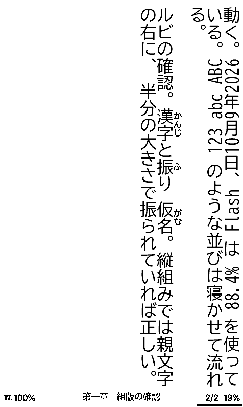

# CrossDiTo

> **CrossDiTo is a personal Xteink X4 Pro test build made directly from [CrossInk 1.5.0](https://github.com/uxjulia/CrossInk), which is itself based on [CrossPoint Reader](https://github.com/crosspoint-reader/crosspoint-reader).** Full credit for the base firmware and every inherited feature belongs to the CrossInk, CrossPoint, and upstream contributors. This repository documents only the changes made on top of CrossInk.

### Supported Device

- Xteink X4 Pro

The current hardware-verified build is [CrossDiTo 1.5.1](./docs/releases/v1.5.1.md). Its [changelog](./CHANGELOG.md) contains only CrossDiTo-specific changes; CrossInk's own history remains with the upstream project.

## 日本語対応（このフォーク） / Japanese support

**English:** this fork (`simeon052/CrossDiTo_jp`) adds a Japanese UI, Japanese SD-card fonts,
and Japanese vertical writing (縦組み, `vertical-rl`) on top of CrossDiTo.
See [docs/japanese.md](./docs/japanese.md) for the implementation notes.

このフォークは CrossDiTo に**日本語UI**と**縦組み**を足したもの。
実装の詳細は [docs/japanese.md](./docs/japanese.md) を参照。

### 追加したもの

| 追加 | 内容 |
|---|---|
| 日本語UI | 774キー中 765キーを翻訳。設定 → 言語 で「日本語」を選ぶ |
| 日本語フォント | `.cpfont v5` を受け付けるようにし、BIZ UDGothic / BIZ UD明朝 / NotoSansJP / NotoSerifJP を取得できるようにした |
| 縦組み | 段組みの流し込み、句読点・かぎ括弧の縦用字形、欧文の90°回転、小書き仮名の変位、ルビ、傍線・打ち消し線・ガイドドット。禁則は既存の処理をそのまま使う |
| 右綴じ | 縦組みではタップとスワイプのページ送り方向を裏返し、進捗バーを右端から左へ伸ばす |
| 行間・字間 | 行間（70〜200%）が列の間隔として効く。字間は縦組み用に0〜30%を新設 |
| 同梱言語の削減 | 英語＋日本語のみを焼く。文字列データが 422,112 B → 37,178 B になり、空いた領域を縦組みに充てた |
| シミュレータ撮影 | 画面のない環境でも実画面をPNGで撮れるようにした（CIの成果物にもなる） |

### 画面

| 縦組みの本文 | ルビ（振り仮名） | 日本語UI（リーダーメニュー） | 日本語UI（設定） |
|---|---|---|---|
|  |  |  |  |

列は右から左、字は上から下。かぎ括弧と句読点は縦用の字形に置き換わり、`CrossDiTo` や
`ESP32-S3` は90°回して流れる。折り返しの行頭に句読点や閉じ括弧は来ない。
ルビは親文字の右に、半分の大きさで振る。

行間（既存の設定）はそのまま列の間隔になる。左が 80%、右が 200%。


いずれもシミュレータの実画面。`scripts/run_simulator_screenshots.py` で撮っている。

### 使い方

1. 設定 → フォントを管理 から `BIZUDGothic` などをダウンロードする
2. 本文フォントにそのフォントを選ぶ（UIの日本語もこのフォントから出る）
3. 設定 → 言語 で「日本語」を選ぶ
4. 縦組みにするなら 設定 → 読書 → 組み方向 を「縦書き」にする

### 既知の制限

- 画像や表を含む本は縦組みで崩れる。組版を「幅と高さを入れ替えた紙面」で行っているため
- バイオニックリーディングは縦組みでは効かない。組版が語を割って測るのに対し欧文は寝かせて描くため、語の位置がずれる。設定は残るが縦組みでは無効になる
- 行間を詰めすぎると列が重なる。ただし同じ値では横組みでも行が重なる
- 日本語フォントの配信は [zrn-ns/crosspoint-jp](https://github.com/zrn-ns/crosspoint-jp) の
  リリース資産に依存している。常用するなら自前にミラーすること
- **実機未検証。** シミュレータの画面までしか確認していない

### 読むものを用意する

[NovelToXteink](https://github.com/simeon052/NovelToXteink) — 小説家になろう・カクヨムの
Web小説をダウンロードし、Xteink X3 / X4 Pro 向けに最適化した EPUB や XTC へ変換する C# アプリ。
縦書き組版とルビにも対応している。

---

## What's different in this fork

CrossDiTo 1.5.1 starts from **CrossInk 1.5.0**. Everything below is a CrossDiTo-specific change made after that baseline. No inherited CrossInk features are presented as work from this fork.

> [!NOTE]
> The figures below are engineering estimates, not controlled battery or stopwatch benchmarks. EPUB structure, cache state, SD-card speed, frontlight warmth, radio use, and the e-ink waveform can materially change the result.

### Rough improvement at a glance

| Usage | Rough expected change from CrossInk 1.5.0 | Why it changes |
| --- | --- | --- |
| Reopen a cached EPUB or reflow after a layout change | About **10-35% less visible wait** in favorable cached cases; about **20-50% less parser/tokenizer work** | A versioned compiled chapter-event cache avoids tokenizing the same XHTML again |
| Normal text page turn | About **10-30% less CPU preparation** and usually **5-15% faster perceived response** | One retained next page, a direct packed-framebuffer glyph path, and one-pass grayscale composition; the panel waveform still sets most of the visible delay |
| Return to a warm Home carousel | Usually near-immediate apart from the e-ink refresh | Reading-progress-only changes no longer rebuild every cached carousel frame |
| Production boot | About **250 ms faster** | USB file transfer starts asynchronously instead of blocking startup |
| Active reading, frontlight and Wi-Fi off | Roughly **10-25% longer reading time** | The CPU drops from 240 MHz to 80 MHz after activity, idle gaps use light sleep, and long panel waits run at the lower clock |
| Active reading at the same numeric 10% frontlight setting | Roughly **5-15% longer reading time** | MCU savings remain useful and CrossDiTo's low-light curve requests less LED PWM duty; the perceived brightness is intentionally lower than CrossInk at the same number |
| Static page, frontlight off | About **20-50% lower MCU-side idle draw**; the whole-device saving is smaller | Deadline-driven input servicing replaces constant polling and allows automatic light sleep |
| Heavy Wi-Fi, first indexing, or repeated image decoding | Roughly **0-10%** | Radio, SD, parser, and display work dominate, leaving fewer idle gaps to optimize |
| Deep-sleep standby | Roughly **0-5%** | Most CrossDiTo savings target active reading and light-idle time, not an already sleeping device |

### Better low-light frontlight control

CrossInk's X4 Pro path used an approximately linear brightness percentage and split that integer percentage between the warm and cool LEDs. At very low mixed settings, both channels could round down to zero. CrossDiTo converts brightness at the panel's full 10-bit PWM precision, applies a perceptual curve, and only then divides the result between the two channels. This keeps **1% reliably on**, gives much finer control in a dark room, preserves the selected warmth, and still reaches the same 100% maximum.

| UI setting | CrossInk nominal combined PWM duty* | CrossDiTo combined PWM duty |
| ---: | ---: | ---: |
| 1% | about 1% (could round to off with mixed warmth) | **0.10%**, minimum non-zero output |
| 5% | about 5% | **0.29%** |
| 10% | about 10% | **0.98%** |
| 25% | about 25% | **6.16%** |
| 50% | about 50% | **25.02%** |
| 75% | about 75% | **55.91%** |
| 100% | 100% | **100%** |

\* CrossInk's nominal value is shown before warm/cool integer rounding. PWM duty is not the same as measured light output or perceived brightness.

### CrossDiTo-only highlights

#### Reading and responsiveness

- Compiles parsed EPUB chapter events into a versioned, layout-neutral cache, so changing font, spacing, margins, or orientation can repaginate without repeating XHTML tokenization.
- Keeps one already-deserialized next page when memory permits and accelerates common glyph drawing and grayscale composition without adding speculative multi-page allocations.
- Shows the resumed reading page before loading recent books, KOReader credentials, or the dictionary; those are loaded only if used.
- Avoids rebuilding the Home carousel merely because reading progress or statistics changed.
- Can paginate the whole book cooperatively in the background for an exact current/total book page display, while keeping the current page readable and input responsive.
- Adds a one-shot **Return to Previous Reading Position** action after an explicit jump.
- Keeps unfinished chapter pagination stable as `current/…` and shows a total only when it is exact, instead of continuously changing a `~current/total` estimate.
- Starts USB file transfer asynchronously, removing about 250 ms from the production boot path while retaining RTC crash reports.

#### Battery, frontlight, and memory

- Uses dynamic 240/80 MHz CPU operation, releases the maximum-frequency lock after 300 ms, enables tickless automatic light sleep, and powers down the ESP32-S3 CPU domain while idle.
- Services touch and buttons by interrupt and deadline, with a slow recovery poll, instead of continuously waking the device to poll input.
- Yields the shared bus and lowers the CPU clock during long e-ink BUSY waits when Wi-Fi is off.
- Keeps frontlight PWM continuous through light sleep, eliminating the idle frontlight flash seen with the earlier power optimization.
- Adds a daily frontlight schedule in 15-minute steps, including schedules that cross midnight.
- Uses fixed-capacity activity ownership and reusable contiguous dithering workspaces to reduce long-session heap fragmentation.
- Uses logged, recoverable allocation failures and bounded EPUB-manifest processing instead of aborting on memory pressure.

#### Display, input, and stability

- Restores the hardware-verified X4 Pro row-band composition and controller sequence, removing the cumulative displaced text fragments and severe ghosting caused by the experimental strip/rectangular update path.
- Performs one clean refresh when returning Home from grayscale content and keeps normal X4 Pro UI changes on the controller-safe full-frame path.
- Fixes blank/stale Quick Resume pages after chapter indexing and the blank-screen or reboot failure after Full Book indexing.
- Fixes the Wi-Fi scan panic by completing status drawing before radio startup and publishing scan results under the render lock.
- Serializes display and storage access where they share a bus while leaving the X4 Pro's independent SDMMC path unblocked.
- Makes a Home carousel swipe advance exactly one book, prevents a touch release from leaking into the next screen, and fixes one-shot long-press dark-mode toggling.
- Hardens KOReader, OPDS, and Nearby Sync rendering/reconnect paths against stack pressure, duplicate packets, timing races, and mismatched acknowledgements.
- Improves simulator parity, render-stack diagnostics, framebuffer reporting, and retained Xtensa panic addresses for future hardware debugging.

#### X4 Pro focus

- Publishes only Xteink X4 Pro production, debug, simulator, CI, OTA, and release targets.
- Pins the matching DIO/Octal-PSRAM SDK, uses the e-ink controller's verified 20 MHz bus limit, and restores 24 KB of internal heap that was previously reserved but unavailable to the app.
- Uses the CrossDiTo 1.5.1 identity, keeps compatibility with existing `/.crosspoint/` data, and adds the minimal monochrome owl branding.

See the [CrossDiTo 1.5.1 release notes](./docs/releases/v1.5.1.md) for the item-by-item changelog, limitations, firmware checksum, and hardware-verification details. Download the firmware from [GitHub Releases](https://github.com/dito94/CrossDiTo/releases/tag/v1.5.1).

---

## Tips for the best reading experience

CrossDiTo uses the X4 Pro's ESP32-S3 and PSRAM, but internal RAM and e-ink bandwidth are still constrained compared with a phone, tablet, or desktop app.

- Keep folders under about 200 files. For the smoothest browsing, aim for 50-100 files per folder.
- Having 1000+ books on the SD card is fine if they are split into smaller folders, such as by author, series, genre, or read/unread status.
- Avoid putting every book in the SD card root. The file browser has to scan and sort the current folder before it can show it.
- Text-first EPUBs are the best fit. Large image-heavy EPUBs, scanned books, comics, and omnibus files with thousands of sections may load slowly or fail under memory pressure.
- As a rough target, EPUBs under 20 MB tend to work the best. Files over 50 MB may still work, but they are more likely to be slow or memory-sensitive, especially if they contain many large images.
- If an EPUB is unusually slow, try [optimizing](./docs/webserver.md#epub-optimization) it with the built-in web optimizer (via File Transfer) before copying it to the SD card: remove unused high-resolution images, split very large omnibus files, and avoid embedding multiple full font families when possible.
- Use a reliable SD card and leave some free space. CrossDiTo stores settings, reading progress, cache files, stats, and generated book data on the card.

## Development Device Simulator

The [device simulator](https://github.com/uxjulia/crossink-simulator) renders the e-ink display in an SDL2 window so firmware changes can be sanity-checked without flashing hardware.

See [Simulator](./docs/simulator.md) for setup, platform notes, keyboard controls, and cache tips.

---

## Installation

Download `CrossDiTo-x4-pro-v1.5.1.bin` from the [CrossDiTo 1.5.1 release](https://github.com/dito94/CrossDiTo/releases/tag/v1.5.1). For an existing CrossDiTo installation, copy the file to the SD card and select **Settings > System > SD Card Firmware Update**. USB command-line flashing is also documented.

See [Installation](./docs/installation.md) for step-by-step flashing and revert instructions.

---

## Documentation

These links are operating manuals for the complete firmware, including inherited upstream behavior. They are documentation, not claims that CrossDiTo created those capabilities.

- [User Guide](./docs/user-guide.md)
- [Installation](./docs/installation.md)
- [SD Card Fonts](./docs/sd-card-fonts.md)
- [Reader Features](./docs/reader-features.md)
- [Dictionary](./docs/dictionary.md)
- [Controls](./docs/controls.md)
- [Simulator](./docs/simulator.md)
- [Data Cache](./docs/data-cache.md)
- [Web server usage](./docs/webserver.md)
- [Web server endpoints](./docs/webserver-endpoints.md)
- [Common issues](./docs/troubleshooting.md)
- [Project scope](./SCOPE.md)
- [Development docs](./docs/development/README.md)

---

## Development quick start

CrossDiTo uses PlatformIO for building and flashing firmware.

See [Getting Started](./docs/development/getting-started.md) for prerequisites, clone setup, and validation commands.

### Nix/NixOS

Nix/NixOS users can enter the development shell with either `nix develop` (flakes) or `nix-shell`:

```bash
nix develop -f nix
# or
nix-shell nix
```

To flash the X4 Pro's ESP32-S3, enable PlatformIO's udev rules in your NixOS configuration:

```nix
services.udev.packages = with pkgs; [ platformio-core.udev ];
```

After rebuilding the system configuration, reconnect the device or reload udev rules.

### Build / flash / monitor

Connect the X4 Pro via USB-C:

```sh
# Xteink X4 Pro
pio run -e x4-pro --target upload
```

`x4-pro` is the only production firmware environment. Running `pio run` without `-e` builds the same target.

See [Testing and Debugging](./docs/development/testing-debugging.md) for serial logging, simulator checks, static analysis, and bug-report guidance.

---

## Repository layout

- `src/` - app orchestration, settings/state, and activity implementations (home, reader, settings, network, boot/sleep)
- `lib/` - supporting libraries: EPUB parsing/layout, fonts, i18n, filesystem helpers, HAL wrappers, and more
- `freeink-sdk/` - the exact vendored hardware SDK snapshot used by the verified X4 Pro release; it contains display, input, storage, frontlight, and battery support
- `web/` - web portal sources (`templates/`, `pages/`, `assets/`); compiled by `scripts/build_web.py` into `src/network/html/*.generated.h`
- `docs/` - user and developer documentation, published via the `site/` Astro site
- `site/` - Astro project that builds `docs/` into the CrossDiTo documentation website
- `test/` - unit tests and EPUB test fixtures
- `scripts/` - build, codegen, and release tooling (i18n generation, web asset building, hyphenation tries, release packaging, etc.)
- `bin/` - helper scripts for formatting (`clang-format-fix`) and CI checks
- `fs_/` - sample SD card contents (books, sleep images, themes) used by the simulator
- `nix/` - Nix/NixOS development shell definitions
- `managed_components/` - ESP-IDF managed component dependencies, fetched automatically during build
- [`SCOPE.md`](./SCOPE.md) and [`CHANGELOG.md`](./CHANGELOG.md) - project scope and complete release history

## Internals

CrossDiTo keeps its 48 KB display framebuffer in PSRAM and stores reusable book data on the SD card, preserving faster internal RAM for tasks, drivers, and latency-sensitive work.

See [Data Cache](./docs/data-cache.md) for the `.crosspoint` layout and [File Formats](./docs/file-formats.md) for binary cache details.

## Notice on Contributions

CrossDiTo intentionally stays narrow and X4 Pro-only. Bug reports may be opened in [CrossDiTo issues](https://github.com/dito94/CrossDiTo/issues). Major features requiring broad device support or ongoing upstream maintenance should be proposed to [CrossPoint Reader](https://github.com/crosspoint-reader/crosspoint-reader).
