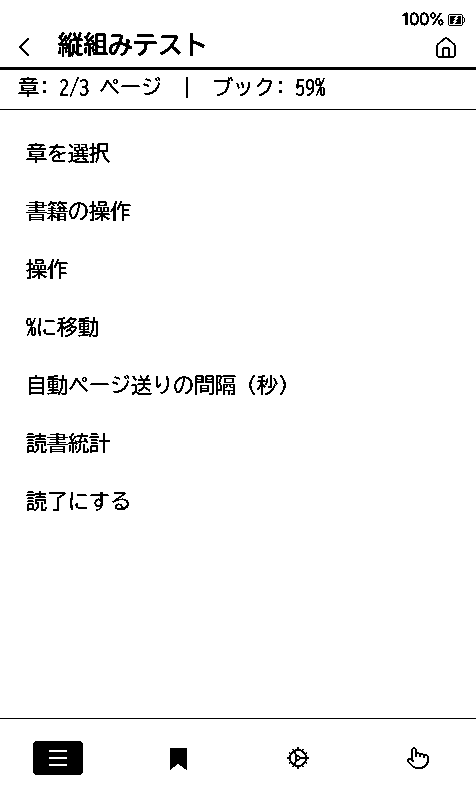
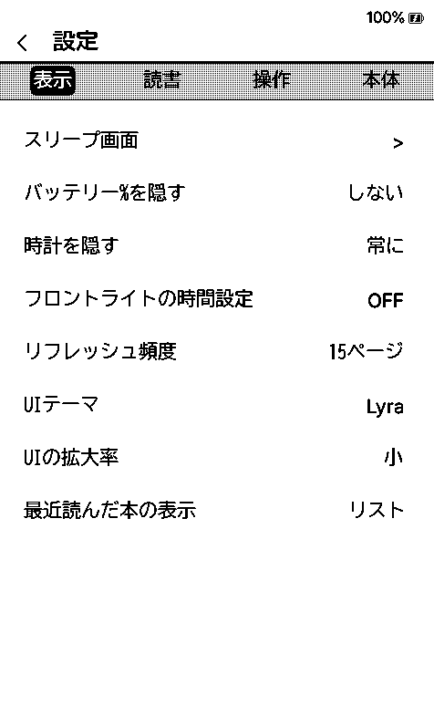

# 日本語対応（CrossDiTo_jp）

このフォークで CrossDiTo を日本語で使えるようにするための作業メモ。

## 現状

| 段階 | 内容 | 状態 |
|---|---|---|
| 1 | 日本語UI（翻訳・フォント入手経路） | **実装済み（シミュレータで確認）** |
| 2a | 縦書き：描画プリミティブ | **実装済み** |
| 2b | 縦書き：設定とレンダースペックの配線 | **実装済み** |
| 2c | 縦書き：段組みの流し込み | **実装済み（シミュレータで確認）** |
| 2d | 右→左のページ送り、進捗バー | **実装済み（シミュレータで確認）** |
| 3 | 青空文庫連携、TXT→EPUB 変換 | 未着手 |

実機は未検証。以下「確認した」はすべてシミュレータの画面での確認を指す。


読むものを用意するには [NovelToXteink](https://github.com/simeon052/NovelToXteink) が使える。
小説家になろう・カクヨムの Web小説を Xteink 向けの EPUB / XTC に変換する C# アプリ。

## Stage 1 でやったこと

### 日本語UI

`lib/I18n/translations/japanese.yaml` を追加した（774キー中 765キーを翻訳、
残り9キーは日付書式のサンプル文字列なので英語のまま）。既訳のうち 310キーは
[crosspoint-jp](https://github.com/zrn-ns/crosspoint-jp) から流用している。

`scripts/gen_i18n.py` は `lib/I18n/translations/*.yaml` を全部読むので、
ファイルを置くだけで言語一覧に「日本語」が出る。ビルド設定の変更は不要。

- `_language_code: "JA"` / `_order: "27"`（既存の最大は 28、27 が空いていた）
- 文字列データは約 20KB 増える

### 日本語フォントの入手経路

CrossDiTo が既定で参照する CrossInk のフォント配信バケットには、**日本語フォントが
1つも入っていない**（Latin 系のみ）。そのため `platformio.ini` の `[base]` で
`FONT_MANIFEST_URL` を crosspoint-jp のマニフェストへ向けた。

```
https://github.com/zrn-ns/crosspoint-jp/releases/download/sd-fonts/fonts.json
```

- BIZ UDGothic / BIZ UD明朝 / NotoSansJP / NotoSerifJP を収録
- `.cpfont` のフォーマット版は双方 `CPFONT_VERSION = 4` で一致
- 8 / 10 / 12 / 14 / 16 / 18 pt を収録。**8/10/12pt** は UI の CJK フォールバックが
  要求するサイズ（`src/SdCardFontSystem.cpp` の `kUiFontSizes`）なので、これが
  無いとメニューの日本語が豆腐になる

> **注意:** 現状は他プロジェクトのリリース資産に依存している。安定運用するなら
> このフォークのリリースへフォントをミラーして、URL を差し替えること。

### .cpfont v5 の受け入れ

配布されている日本語フォントは **v5** で、CrossDiTo の読み込みは v4 固定だった
ため、そのままではマニフェストを差し替えても `Unsupported version: 5` で弾かれる。
`SdCardFont::load()` が v4–v5 を受け付けるようにした。

v5 と v4 の差は次の1点だけで、v4 の読み方をしても他のオフセットはすべて一致する。

- スタイルTOCの offset 28（v4 では予約領域だった4バイト）に、縦書き用の
  vert セクションの位置が入る
- ファイル末尾にその vert セクションが付く
- グローバルヘッダ32バイト / TOCエントリ32バイトという寸法は v4 と同じ

`CPFONT_VERSION` は配信URLに埋め込む版番号なので 4 のまま据え置き、受け入れ上限を
`CPFONT_VERSION_MAX_SUPPORTED` として別に持たせている。

vert セクション（OpenTypeの縦書き代替字形）は Stage 2 で使う。v4 の読み方では
無視されるだけなので、Stage 1 の時点では実害も利得もない。

### 日本語が表示される仕組み（既存機能）

CrossDiTo（＝CrossPoint 1.5 系）には既に CJK まわりの土台がある。Stage 1 で
新規に実装したものではない。

- CJK の行分割: `utf8IsCjkBreakable()`
- 禁則処理: `isNoBreakBeforeCjkPunctuation()` / `isNoBreakAfterCjkPunctuation()`
  （`lib/Epub/Epub/ParsedText.cpp`）
- ルビ（振り仮名）: `TextBlock` の `rubyTexts` + `EpdFontFamily::RUBY_CONTINUE`
- **UIのCJKフォールバック**: 選んだ本文用SDフォントが CJK を含む場合
  （U+4E00 / U+3042 / U+30A2 / U+AC00 で判定）、同じフォントの 8/10/12pt を
  読み込んでUIフォントのフォールバックに登録する
  （`src/SdCardFontSystem.cpp:245` 付近）

つまり **本文フォントに日本語フォントを選べば、メニューの日本語も出る**。

## 使い方（Stage 1 時点）

1. 設定 → フォントを管理 から `BIZUDGothic` などをダウンロード
2. 本文フォントにそのフォントを選択
3. 設定 → 言語 で「日本語」を選択

## 縦書き（Stage 2）

### 2a: 描画プリミティブ（実装済み）

- `lib/GfxRenderer/VerticalTextUtils.h` — 正立/横倒しの判定、小書き仮名の変位、
  vert 代替字形の対象判定
- `SdCardFont` — `.cpfont v5` の vert セクション読み込み（遅延ロード）
- `GfxRenderer::drawTextVertical()` / `getTextAdvanceVertical()`

### 2b: 設定とレンダースペック（実装済み・UIは未公開）

- `CrossPointSettings::writingMode`（横書き/縦書き）と `verticalCharSpacing`
- `ReaderRenderSpec::verticalWriting` / `verticalCharSpacing` を追加し、
  **署名にも含めた**。組み方向を変えるとセクションキャッシュが作り直しになる
- `GfxRenderer::VerticalTextScope` — この間だけ `getTextAdvanceX()` が縦の送りを
  返す。**これが 2c の要**で、`ParsedText` にある17か所の測定呼び出しを
  1つも書き換えずに、既存の行分割（禁則込み）をそのまま列割りに流用できる
- `TextBlock::render()` — 縦組みでは `wordXpos()` を「列内の位置」として y に足す

設定項目はまだ設定画面に出していない。2c が無いと選んでも何も起きないため。

### 2c: 段組みの流し込み（実装済み・未検証）

配線した場所は4つ。

| 場所 | 役割 |
|---|---|
| `readerRenderSpecForProfile()` | 縦組みのとき viewport の幅と高さを入れ替える |
| `Section::createSectionFile()` / `startBuild()` / `buildSomeMore()` | 組版の測定を縦にする（`VerticalTextScope`） |
| `EpubReaderActivity::renderContents()` | 紙面の右上と列幅を渡す。リーダーの描画の唯一の入口なので、走査パス・本描画・グレースケールを一括で覆える |
| `PageLine::render()` / `TextBlock::render()` | 配置と描画 |

設定（設定 → 読書 → 組み方向 / 縦書きの字間）も公開した。切り替えると
セクションキャッシュの署名が変わるので、開いている本は組み直しになる。

**まだ足りていないもの**:

- 画像・表は回転した紙面に置かれるので崩れる（方針として許容）
- ルビ・バイオニックリーディング・ガイドドット・背景反転は縦組みでは描かれない
- 脚注プレビューや抜き書き選択など、`renderContents()` を通らない描画経路は
  横組みのまま

以下は採用した方式の説明。


**素直にやると大きすぎる。** レイアウトエンジン
（`lib/Epub/Epub/parsers/ChapterHtmlSlimParser.cpp`）は `currentPageNextY` を
**49か所**で触っていて、段落・見出し・罫線・画像・表がそれぞれ独自に高さを
足している。これを全部「方向に依存しない座標」へ書き換えるのは、変更量に対して
壊す危険が大きい。

**回転した座標系で組む方が小さい。** パーサには「幅＝画面の高さ、高さ＝画面の幅」
の紙面を渡し、既存のまま横組みとして組ませる。列は「行」として上から下へ積まれ、
語は「行内」で左から右へ進む。そのうえで**配置の瞬間だけ座標を変換する**。

```
画面の x = 本文右端 − 組版上の y − 列幅
画面の y = 本文上端 + 組版上の x
```

こうすると触るのは3か所で済む。

1. レンダースペックの viewport を縦組みのとき入れ替えて渡す
2. `PageLine::render()` / `PageImage::render()` などの配置で上の変換を掛ける
   （`lib/Epub/Epub/Page.h`）
3. `TextBlock::render()` は 2b で対応済み

**この方式の弱点**: 画像と表は「回転した紙面」に置かれるので、幅と高さの意味が
入れ替わる。文章だけは正しく組めるが、画像を含む本は崩れる。第一版としては
「本文は正しい・画像は既知の崩れ」を明示して出し、画像だけ別扱いにするのが
現実的。

### 2d: ページ送りとUI（実装済み）

縦組みの本は右綴じで、読み進む向きが右から左になる。画面を触る操作と進捗バーを
紙と同じ向きに合わせた（`ReaderUtils::detectTouchPageTurn` / `BaseTheme::drawStatusBar`）。

- タップ: 「戻る」の1/3が右端に移る
- スワイプ: 左右を入れ替える
- 進捗バー: 右端から左へ伸ばす

**物理ボタンは触っていない。**「次へ」は組み方向によらず次のページのままにした。
ボタンの意味は紙の綴じ方ではなく、押した人の意図で決まる。

シミュレータのスモークテスト（`src/simulator/SimulatorSmokeTest.cpp`）も、タップ位置を
組み方向に合わせた。直すまでは「次へ」のつもりで右端を叩いて1ページ目に張りついていた。

### 行間と字間

縦組みの列の間隔は、**横組みの行間の設定がそのまま効く**。組版を「幅と高さを入れ替えた
紙面」で行っているので、横組みの行の高さがそのまま列の幅になる。

```cpp
// EpubReaderActivity::renderContents()
verticalTransform.columnWidth =
    std::max(1, static_cast<int>(renderer.getLineHeight(fontId) * SETTINGS.getReaderLineCompression() + 0.5f));
```

| 設定 | 範囲 | 縦組みでの意味 |
|---|---|---|
| 行間（`lineHeightPercent`） | 70〜200%、1%刻み | 列の間隔 |
| 字間（`verticalCharSpacing`） | 0〜30%、5%刻み | 1文字ごとの送りに足す量（縦組み専用） |


詰めすぎると列が重なるが、同じ値では横組みでも行が重なる。縦組み固有の破綻ではない。
実用域は 100% 以上。

## 途中で踏んだ2つの穴

どちらも「ビルドが通る」ことと「読める」ことの差で、絵を見るまで気づけなかった。

### 本文が読めない — 字送りを字形表から取っていた

縦組みの本文が黒い塊になっていた。潰れた字形ではなく、**十数文字が同じ座標に
積み上がったもの**だった。

`getTextAdvanceVertical()` と `drawTextVertical()` が `getGlyph()` から `advanceX` を
読んでいた。SDカードフォントの字形はページ単位の遅延ロードなので、組版の時点で
まだ載っていない字は `nullptr` が返り、送りが 0 になる。

`GfxRenderer::verticalCharCellSize()` を足して、送りは横組みの測定（`getTextAdvanceX`）
から取るようにした。こちらは `SdCardFont` の advance テーブルを見るので、字形が
無くても正しい値を返す。

### UIの日本語が全部豆腐（◆） — 誰も字形を載せていなかった

UIの内蔵フォントはラテン専用なので、日本語は `resolveTextFontId()` が同じ大きさの
SDフォントへ回送する。ところが本文が走査パス（`FontCacheManager::PrewarmScope`）で
1ページぶんの字をまとめて先読みしているのに対し、**UIには何の仕掛けも無かった**。
字形が載っていないまま描かれるので、`getGlyphData()` が置換グリフに落ちて ◆ が並ぶ。

回送を決めた時点で、その文字列ぶんだけ字形を載せるようにした
（`GfxRenderer::ensureFallbackGlyphsLoaded()`）。直前と同じ要求はハッシュで弾く。
`truncatedText()` は1文字ずつ削りながら `getTextWidth()` を繰り返し呼ぶので、
毎回SDを読ませるわけにはいかない。

| リーダーメニュー | 設定 |
|---|---|
|  |  |

## 絵で確かめる

縦組みは「コンパイルが通った」では何も確認できない。字が重なっていないか、句読点が
右上に寄っているか、列が右から左へ積まれているかは、描いた絵を見る以外に確かめようがない。

```bash
python scripts/run_simulator_screenshots.py --out shots/
python scripts/run_simulator_screenshots.py --horizontal --out shots-h/   # 横組みと比べる
python scripts/run_simulator_screenshots.py --setting lineHeightPercent=200 --out shots/
```

画面のない環境では `xvfb-run` 越しに動かす（`SDL_VIDEODRIVER=dummy` では
`SDL_CreateRenderer(ACCELERATED)` が失敗し、撮影せずに戻る）。CI からも同じものを回して、
画像を成果物として持ち帰っている。

## そのほか未対応
- 日付書式のサンプル表示（`STR_DATE_FORMAT_*`）は英語のまま。実際の描画も英語の
  月名を出すため、ラベルだけ和訳すると表示と食い違う
- 青空文庫のTXT形式には未対応
